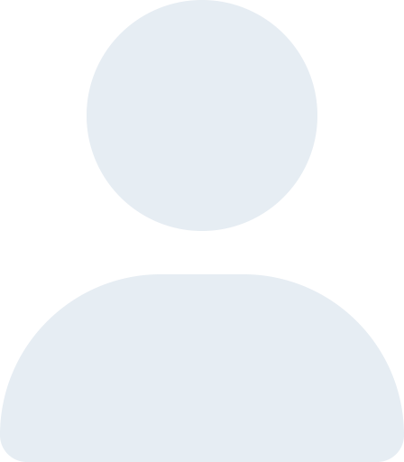
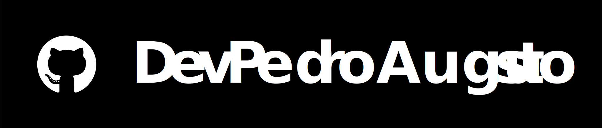

# Pedro Augusto - Desenvolvedor Front-End 

> Olá!, Sinta-se a vontade para visualizar e todos os projetos desolvidos por mim com foco melhor experiência no desenvolvimento de sites e ferramentas, não se esqueça de favoritar e de me acompanhar nas redes sociais

___

##  Sobre mim

- Desenvolvedor Front-End
- Foco em desenvolvimento WEB
- Cursando Sistema da informação (5 semestre)

___

##  Linguagens de programação
  
**Linguagens Base**

**Frameworks**
  

 

<b>IDE</b>

**Ferramentas**

___

##  GitHub Status 

> _Obs: Caso não esteja carrgando tente aumentar e diminuir o zoom_

___

## ⭐ Projetos Destacados 

> Aqui estão alguns dos meus projetos mais recentes e interessantes:

___

## 🗄 Repositórios
> Dê uma olhada nos meus repositórios para encontrar uma variedade de projetos e cada linguagem que foi desenvolvido.

**Projetos**
  
| Repositório | Veja Renderizado | HTML,CSS,JS | Angular | React |
|-------------|------------------------------|:-----------:|:-------:|:-----:|
| [Pokedex](https://github.com/DevPedroAugusto/Pokedex) | [Link indisponível](https://github.com/DevPedroAugusto/Pokedex) | ✔ | Em desenvolvimento  | Em desenvolvimento |
| [Calculadora](https://github.com/DevPedroAugusto/Calculadora)| [Link indisponível]() | Em desenvolvimento | Em desenvolvimento  | Em desenvolvimento |
| [GameStore](https://github.com/DevPedroAugusto/GameStore) | [Link indisponível]() | Em desenvolvimento | Em desenvolvimento  | Em desenvolvimento |

 

<b>Cursos</b>

  
| Plataforma | Curso | Linguagens | Instrutor | Status | 
|------------|-------|------------|:------:|:------:|
|[Udemy](https://github.com/DevPedroAugusto/Udemy) | Formação Front End | HTML, CSS, JavaScript, React | [@matheusbattisti](https://github.com/matheusbattisti)| Em andamento |

___

## 💻 Ferramentas de trabalho / estudo 

  
  
 

 
 
 
<b>Estudos</b>

   
 
 

 

___

## 🆕 Atualizações

Acompanhe para ver mais atualizações conforme estou desenvolvendo, aprimorando, e refazendo meus projetos com outras bibliotecas. Fique de olho nos README.md para mais informações sobre atualizações. 

___

## 📲 Contato 

> Sinta-se à vontade entrar em contato se tiver alguma pergunta, sugestão ou queira me contratar. 

Obrigado por visitar! 🚀
___

_Pedro Augusto - Desenvolvedor Front-End © 2024_

